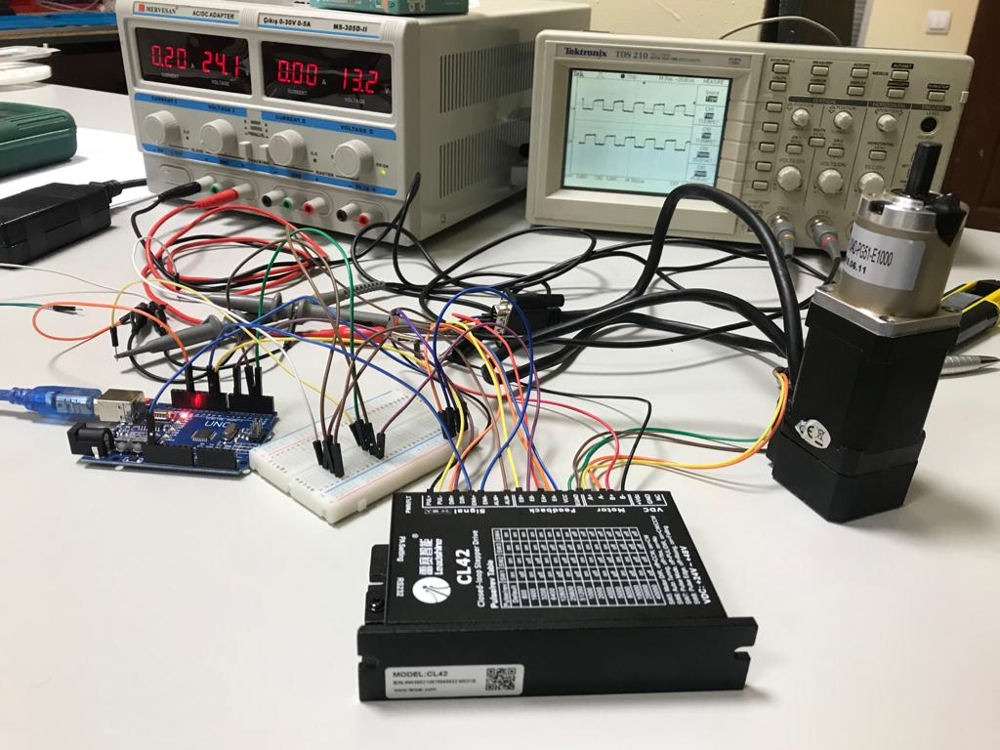
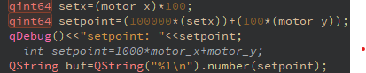

	 High Precision Stepper Encoder Motor
Position and Speed Control by using 2 stepper motors, motor driver,
breadboard to see output of stepper motor on oscilloscope, power supply
and Arduino as we see in the *Figure 12*. First, I wiring necessary
connections, I could control speed of motor in microseconds domain and
position of the motor. Then, I tested how many pulses are equal to 360
degrees. Normally, when 40600 pulses are applied, it is 360 degrees, but
when the Arduino is only created a long int and multiplies with each
other, there were very small negligible deviations. Normally this step
motor's 1.7 degree equals to 1 step. However, I could spin smaller steps
by using this driver since we can adjust resolution. I wiring
connections according to examining datasheet of the driver.

	In the *Figure 13* we can see the system.
Here we have a thing that we want to control, in this case we are
controlling laser. Below motor controls laser's x axis and above motor
controls laser's y axis.

	There was a lot of cable and I designed a
PCB board that leads we get rid of cable (*Figure 14)*. This is actually
just copper circles that provides electrical conductivity throughout 360
degrees.

Motors spun one by one although I wanted to run motors at the same time.
I created an algorithm that provides running at the same time. After I
tested algorithm, I faced with a problem that there were some missing
steps. Then, I fixed step missing (*Figure 15*).

	I provided communication between 2 Arduinos
and understood communication principles.

After I learned communication principles, I literature reviewing about
Qt Framework serial communication and I provided communication Arduino
by coding Qt framework as we see below.

	Then, company wanted me to build an interface on Qt to control laser
easily. First, I created the necessary environment and determined the
boundaries use mouse press event function on Qt which is used for
showing x and y coordinates of mouse when we pressed any points in the
window. I designed a dynamic interface on Qt (*Figure 18*). I used
mousePressEvent function to get x and y axis value from widget and send
these values to Arduino.

	However, I faced with another problem
which we couldn't send String data or 2 double data separately from Qt
to Arduino. So, I solved this problem by sending merged data. As you see
in the algorithm (*Figure 19*), we multiply x with 10 million and sum a
hundred times of y on qt. So, we have a data whose first 5 digits
represent x, and last 5 digits represent y. Then, we divided data in
middle and then divided by 100 to get x axis and y axis separately.

	Then, I faced with another problem that was
when user pressing map on qt in succession, x axis motor spins forever.
Solution of this problem creating object that we assign minus operator
between setpoint and temporary axis value (*Figure 20*). I had to change
some part of code most of the time because we are dealing with
microseconds on Arduino and I should be careful when I use some
functions for example println, minus operator or Serial.write since
Arduino processor is not so fast.

	Then, company wanted me to design a new Windows
desktop application that sending 2 lasers to at the same point while we
know only location of lasers and target object. First, I designed a
dynamic interface (*Figure 21*).

Then, I focus on a math calculation which provides us which angles
between laser and target object and I created algorithm according to
some math calculations as in the below:

$$\text{motor}_{\text{horizontal}} = \tan^{- 1}{\frac{y}{x},\ for\ x > 0}$$

$$\text{motor}_{\text{horizontal}} = \tan^{- 1}{\frac{y}{x} + 180,\ for\ x < 0}$$

$$\text{motor}_{\text{vertical}} = \tan^{- 1}\frac{z}{\sqrt{x^{2} + y^{2}}}$$

	After that, I calibrated system by putting
a target object over the wall and measured x, y and z axis distance
between laser and target object by using meter and I faced with a
problem that when x and y location on laser is both 0; x, y and z are
all 0; motors spin constantly. This problem is because of tan^-1^(0/0)
is undefined, actually 0/0 is undefined. Using if conditions for these 2
possibilities and inside of if doing nothing. Another problem is that
when I sent 215 and bigger degree of x position motor, output was
different from what I expected. Normally integers are 32 bits in Qt
platform. When I sent 214 degrees for x axis motor, merged data would be
2140000000 and if I sent bigger than 214 degrees for instance 215.01 for
x and 35.26 for y axis motor, merged data would be bigger than 32 bits
(*Figure 22*). So, I solved this problem by raising the bit to 64
(*Figure 23*).

	Then, I focus on setting coordinate system.
First, I send inputs according to below table respectively.

  Area (at order in code)   X    Y
  ------------------------- ---- ----
  1^st^                     \+   \+
  4^th^                     \+   \-
  2^nd^                     \-   \+
  3^rd^                     \-   \-

And output of the system was as in the *Figure 24*.

	I have to detect if z axis is negative, do
nothing because we can't send laser under the system according to
design. There was a problem only 4^th^ area of coordinate system. I
solve this problem by detecting if x axis positive and y axis negative,
sign of motor y must be changed because we had to send coordinates
properly.

	I changed the sign of motor y on Arduino
part (*Figure 26)*. So, if I would like to send laser 4^th^ area of
coordinate system, laser goes properly.
